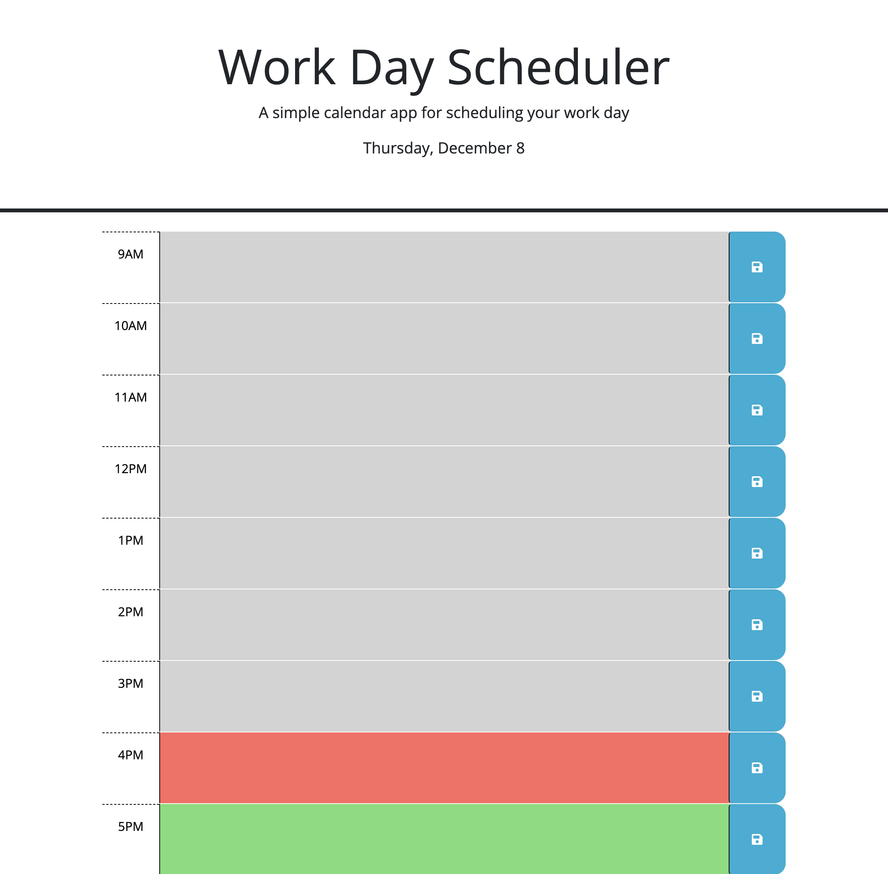

# Work Day Scheduler

[Link to project](https://ryan-young17.github.io/todo-schedule/)

## Table of Contents
- [Description](#description)
- [Visuals](#visuals)

## Description

This work-day scheduler allows a user to input their daily to-dos for each hour of the day with an option to save to their local storage, so their tasks don't disappear upon the page reloading. This application also provides the user with the current day of the month and specific colors marking whether the time is in the past, present, or future for easier viewing.

## Visuals

